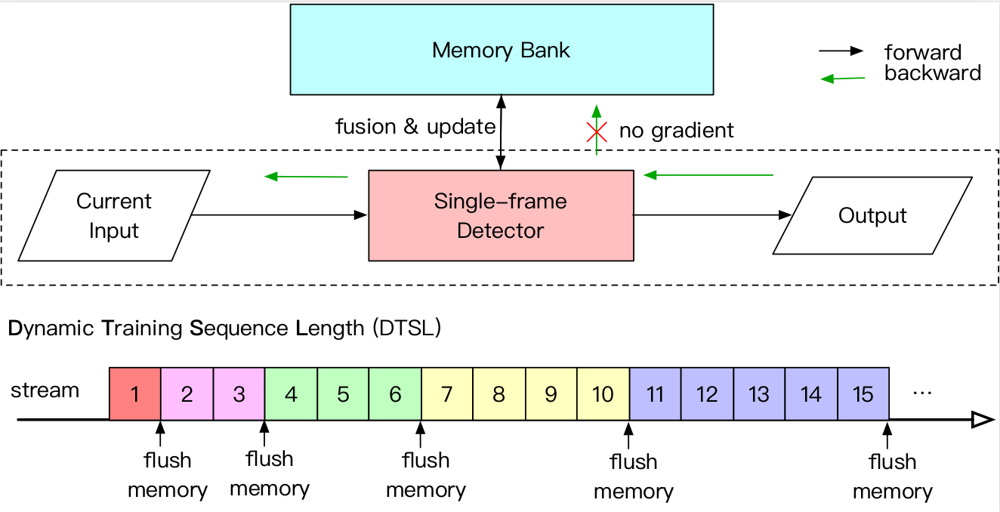

# INT: Towards Infinite-frames 3D Detection with An Efficient Framework

It is natural to construct a multi-frame instead of a single-frame 3D detector for a continuous-time stream.
Although increasing the number of frames might improve performance, previous multi-frame studies only used
very limited frames to build their systems due to the dramatically increased computational and memory cost.
To address these issues, we propose a novel on-stream training and prediction framework that, in theory,
can employ an infinite number of frames while keeping the same amount of computation as a single-frame detector.
This infinite framework (INT), which can be used with most existing detectors, is utilized, for example,
on the popular CenterPoint, with significant latency reductions and performance improvements.
We've also conducted extensive experiments on two large-scale datasets, nuScenes and Waymo Open Dataset,
to demonstrate the scheme's effectiveness and efficiency.  By employing INT on CenterPoint,
we can get around 7% (Waymo) and 15% (nuScenes) performance boost with only 2~4ms latency overhead,
and currently SOTA on the Waymo 3D Detection leaderboard.

  

> **INT: Towards Infinite-frames 3D Detection with An Efficient Framework**,             
> *[ver.ECCV2022](https://www.ecva.net/papers/eccv_2022/papers_ECCV/papers/136690190.pdf)* | *[ver.Arxiv(more details)](https://arxiv.org/abs/2209.15215)*

    @article{xu2022int,
      title={INT: Towards Infinite-frames 3D Detection with An Efficient Framework},
      author={Xu, Jianyun and Miao, Zhenwei and et al.},
      journal={ECCV},
      year={2022},
    }

# Highlights

- **Simple and Fast:** INT is an on-stream multi-frame system made up of Memory Bank and Dynamic Training Sequence Length that can theoretically 
be trained and predicted using infinite frames while consuming similar computation and memory as a single-frame system.

- **SOTA**: Our 100-frames INT is currently among SOTAs (w/o ensemble) on Waymo 3D Detection [leaderboard](https://waymo.com/open/challenges/2020/3d-detection/).

- **Extensible**: INT can be employed on most detectors, even for other tasks, like segmentation.

## Main results

#### 3D detection on Waymo val set

|         |  #Frame | Veh_L2 | Ped_L2 | Cyc_L2  | MAPH   |  latency(ms)  |
|---------|---------|--------|--------|---------|--------|-------|
|INT-1s   | 2       |  69.4     |  69.1      |  72.6       |   70.3     |   74.0    | 
|INT-1s   | 10      |  72.2    |  72.1      |  75.3       |   73.2     |  74.0     |
|INT-2s   | 2       |  70.8     |  68.7      |  73.1       |   70.8     |   78.9    | 
|INT-2s   | 10      |  73.3    |  71.9      |  75.6       |   73.6     |  78.9     |

#### 3D detection on Waymo test set

|         |  #Frame | Veh_L2 | Ped_L2 | Cyc_L2  | MAPH   |   latency(ms)  |
|---------|---------|--------|--------|---------|--------|-------|
|INT-2s | 10       |  76.2     |  72.8      |  72.7      |   73.9     |  78.9   |
|INT-2s | 100      |  77.6     |  74.0      |  74.1      |   75.2     |  78.9   | 

1s stands for 1-stage, 2s stands for 2-stage. 
All results are tested on a GeForce RTX 2070 SUPER with batch size 1.

## Use INT

### Installation

Please refer to [INSTALL](docs/INSTALL.md) to set up libraries needed for distributed training and sparse convolution.

### Benchmark Evaluation and Training

Please refer to [GETTING_START](docs/GETTING_START.md) to prepare the data. 

Use configs with "_small_" tag in [configs](configs) to reproduce our results. The "_big_" tag ones bring better results, and you can try it too. 

## License

INT is release under MIT license (see [LICENSE](LICENSE)). It is developed based on [CenterPoint](https://github.com/tianweiy/CenterPoint). 
Note that both nuScenes and Waymo datasets are under non-commercial licenses.

## Acknowlegement
We sincerely thank the following open-source code.

* [CenterPoint](https://github.com/tianweiy/CenterPoint)
